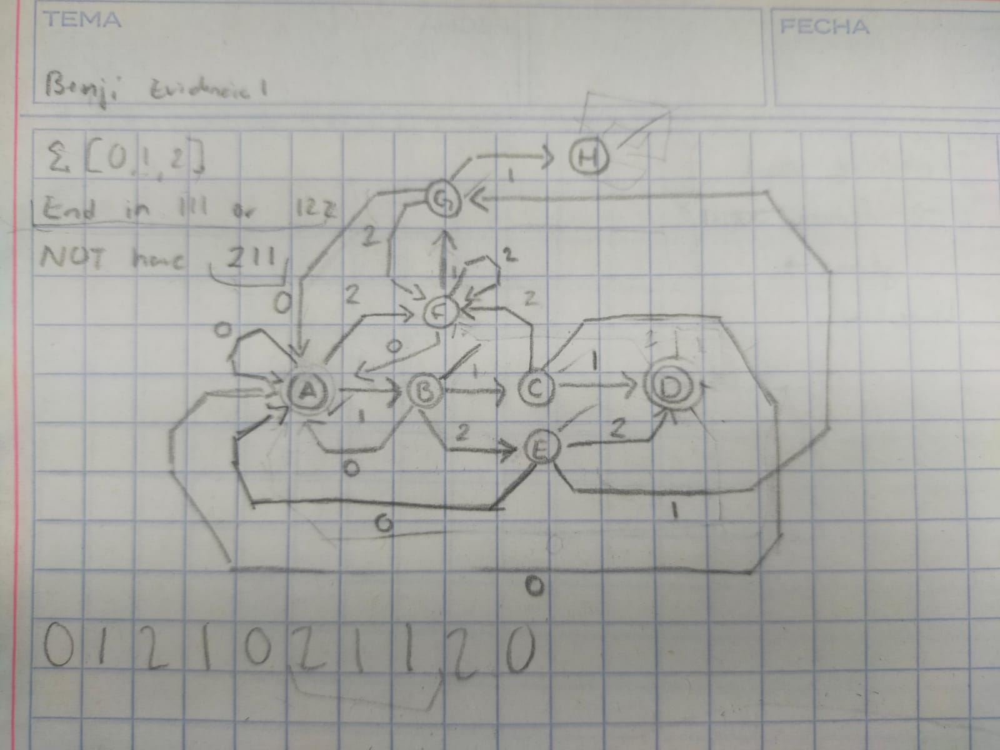
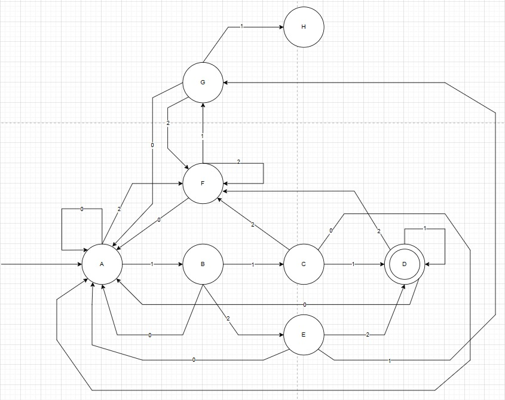
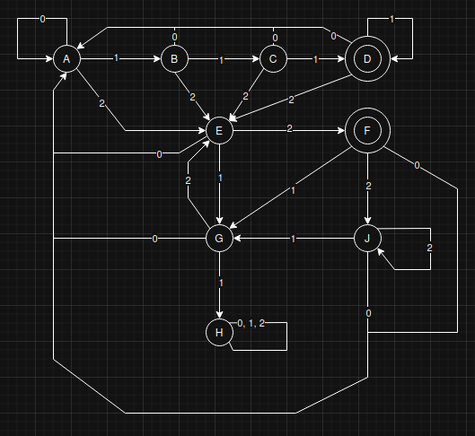

# Implementación de Autómatas y Expresiones Regulares

## Alejandro Adrián García Martínez

## Descripción
Para este proyecto se ha elegido un lenguaje de tipo matemático el cuál tiene las siguientes reglas:  
1. Los únicos carácteres en el lenguaje son 0, 1 y 2.
2. La cadena debe terminar con 111 o con 122.
3. La cadena no puede tener en ningún momento 211, de lo contrario no será válido.  

## Autómata
Para solucionar y generar el algortimo que verifique la cadena, se diseñó un automata para vizualizar los dieferentes estados por lo que podría pasar y poder entender y diseñar de forma eficiente el algoritmo más adelante en prolog.
### Primer diseño
El primer diseño diagrama del automata es el siguiente:  

En este primer diseño se buscó dar prioridad a la segunda regla del lenguaje, de ahí se añadieron rutas que faciliten la trancisión entre todos los posbles estados y se integró el estado "h" en el que la única forma para llegar es incumplir la tercera regla.

### Segundo diseño
Para el segundo diseño del diagrama se contempló la posibilidad de que la cadea pueda transicionar en el estado "d" o estado final y no necesariamente terminar ahí, de esta forma evitar que en un punto se coloque 111 o 122 y que el automata lo cuente como correcto incumpliendo la segunda o incluso la tercera regla.  
Finalmente se consiguió este diseño:


### Diseño final
Para el diseño final se descubrió que en el anterior diseño se podía colocar el valor 211 después de engañar al automata al llevarlo al final con una cadena de caracteres que termine en 122 para aprovehcar el bucle infinito de "1" diseñado para cadenas que utilicen muchos 1 con secutivos al final.

Para resolver esto se implemento un nuevo estado final para la secuencia 122 de esta forma, el primer estado final, queda únicamente reservado a secuencias que concluyan en 111, así se puede prevenir el uso de 122 para engañar al automata, también se designo un nodo que se encargue de gestionar todos los cambios de estado relacionados con 2 que es el nodo número 2. También se Diseño el nodo "j", el cuál es el encargado de gestionar las salidas del nuevo nodo final "f", esta forma si hay más caracteres después de un 122 en la secuencia, no se necesita recurrir a un blucle dentro del nodo final que pueda permitir cadenas incorrectas, si no que esta responsabilidad se le designa a un nodo especial que permite conexiones con el resto del automata.



## Expresión regular
Así mismo se diseño una expresión regular que permitiera solucionar el problema como el automata por medio de la lectura de caracteres y restricciones en el mismo

### Primer diseño
En el primer diseño se busco principalmente la prohibición de que se rompa la tecercera regla del lenguaje, por lo que rápidamente se volió muy restringido como se pede ver a continuación:
```
/(0|1|2)?((0|2)?|(00|01|02|10|20)?)+(111|122)$/gm
```
Así mismo se podía burlar facilmente las mismas restricciones y romper la tercer regla, también no permitía que existieran todas las posibles combinaciones del lenguaje, es por eso que se decidió cambiar de estrategia y utilizar "Assertions".

### Segundo diseño
Con ayuda de los "Assertions" se pudo simplificar de gran manera la expresión regular, ya que al utilizar el Assertion ``` ?! ``` podemos negar todas las instancias de un caracter o un grupo de caracteres de este punto en adelante, de esta manera podemos simplemente indicar que niegue todas las instancias de 211, restringir que los únicos caracteres disponibles sean los del lenguaje e indicar que debe terminar en 111 o 122, dando como resultado el segundo diseño:
```
^(?!.*211)[012]*(111|122)$
```

## Algoritmo Automata
Para el algoritmo del automata se decidió que se realizara de forma recursiva, de esta forma sería más fácil recorrer la lista completa y solamente detectar el estado final, si es "d" significa que es válido si es cualquier otro significa que no es válida la secuencia.  
Se coloco "d" como un caso base con este propósito en mente
``` Prolog
estado_final(d).
estado_final(f).
```
Para comenzar el sistema se entrega una lista al sistema como por ejemplo ```[0,1,2,1,0,0,0,1,1,0,0,1,2,1,2,1,2,0,1,1,1]``` por medio de la función ```inicio```, ya que aquí se indica que el automata iniciará desde el estado "a" como lo indica el diagrama, después se llama la función recursiva.
``` Prolog
camino([Set | Lista], Letra):-
    route(Letra,Set,X),
    camino(Lista,X).
```
Una vez se recorre toda la lista y queda vacía, el programa cae en un caso base donde checa el estado donde termino con el estado final, si es el mismo entregará un valor booleano ```true .``` de lo contrario entregara ```false.```

### Complejidad
Al tener que recorrer la lista de caracteres según el elemento dado hasta vaciar la lista se puede entender que la función principal del algoritmo es de ```O(n)```, ya que tiene que recorrer "n" cantidad de veces la lista para conocer el nuevo estado del automata. también no escala a ```O(n²)``` ya que al entregar la nueva lista por medio de recursividad se elimina el elemento revisado, por lo que al llamarse a si misma mantiene su complejidad ```O(n)```.

En cuanto a las demás funciones, solo sirven como axuliar para permitir la interacción con el algoritmo de una forma más sencilla, por lo que son ```O(1)```.

Con todo esto en mente se puede definir que la complejidad final es de ```O(n)``` en el caso promedio y en el peor caso y ```O(1)``` en el mejor, dada la situación que en la cadena entregada haya solo un número y que este sea el primero en la lista es decir 0.

## Algoritmo Expresión Regular
Para el algoritmo de la expresión regular se realizó en python aprovechando la biblioteca de "Regular Expressions" llamada "re", con esta biblioteca se pueden utilizar funciones como ```re.match()``` que permite revisar una secuencia de caracteres dado un patron.  
De esta manera generé una función que permita revisar los strings de caracteres y regrese una expresión booleana, así pudé realizar varias pruebas de forma rápida.
``` Python
def test (prueba):
    if re.match(patron, prueba):
        return True
    else:
        return False
```
### Complejidad
Igual que el caso anterior es una complejidad de **O(n)** ya que se revisan n caracteres dependiendo de la longitud de la cadena entregada.

## Pruebas
Las pruebas de las expresiones regulares se encuentran el archivo ```expresionRegular.py``` así como el algoritmo.  
Para el automata las pruebas se encuentran en el archivo ```pruebasAutomata.pl``` y se debe correr el algoritmo ```automata.pl``` por separado.   
La forma correcta para verificar estas pruebas es correr el archivo del algoritmo de la siguiente forma en la carpeta donde se encuentra:
```
swipl automata.pl
```
Ya en consola se puede copiar del archivo de pruebas y pegar en consola con click izquierdo, se debe ver de la siguiente forma:
```Prolog
1 ?- inicio([0,1,2,1,0,0,0,1,1,0,0,1,2,1,2,1,2,0,1,1,1]).
```

## Referencias
Child, D. (2020). Regular Expressions Cheat Sheet. Recuperado de: https://cheatography.com/davechild/cheat-sheets/regular-expressions/  
Frank, E. (s.f.). Formal Language Theory. pp 94 - 112. [PDF]  
Tejedor, J. (2020). Introducción a expresiones regulares. Recuperado de: https://www.acceseo.com/introduccion-a-expresiones-regulares.html
